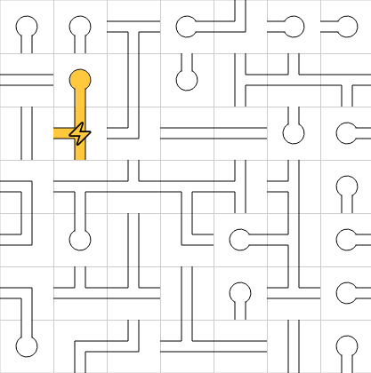
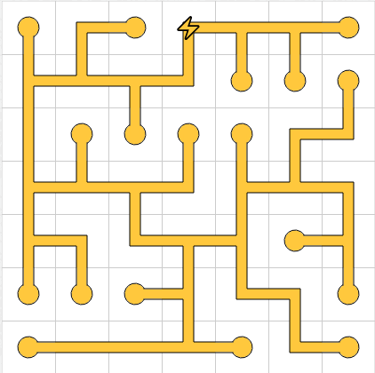

# 🔌 Network Puzzle Solver

Welcome to the **Network Puzzle Solver**! This is an open-source program written in C# that automatically solves Network/Pipes puzzles by scanning them, computing the optimal solution in under 1ms, and even moving the mouse to interact with the puzzle on your Windows machine. 🚀

## 🌟 Features

- **Lightning-Fast Solving**: Our algorithm can solve even the most complex Network/Pipes puzzles in under 1ms. ⚡
- **Automated Interaction**: The program can scan the puzzle, solve it, and automatically move the mouse to complete the puzzle for you. 🖱️
- **Support for Classic Puzzles**: It handles all types of classic Network/Pipes puzzles, no matter the difficulty level. 🧠
- **Easy to Use**: Simply run the program, and it will do the rest. Minimal setup required! 🛠️

## 🚀 Getting Started

### Prerequisites

- Windows Operating System
- .NET (version 8.0 or later)

### Usage
Prepare the Puzzle: Open the Network/Pipes puzzle on your screen.
Run the Program: The solver will automatically scan the puzzle.
Watch the Magic: The program will solve the puzzle and move the mouse to complete it!

## 📺 Video Example
Check out a video demonstration of the solver in action: https://youtu.be/76fZsaBl7WU Watch on YouTube

## 🛠️ Contributing
Contributions are welcome! Whether it's improving the algorithm, fixing bugs, or adding new features, feel free to make a pull request. For major changes, please open an issue to discuss what you would like to change.

## 📜 License
This project is licensed under the MIT License - see the LICENSE file for details.

## 📧 Contact
If you have any questions or feedback, feel free to reach out via the repository's issues page.

Happy solving! 🎉
